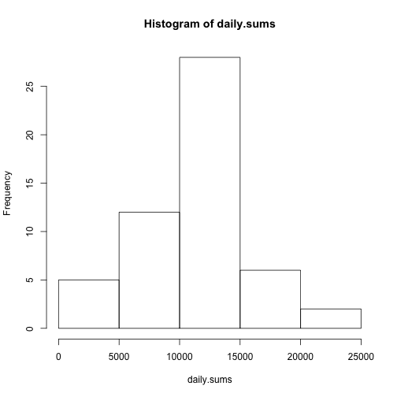
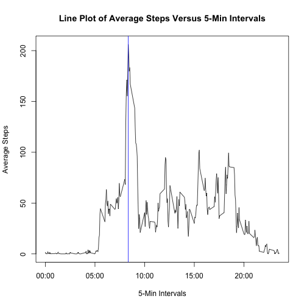
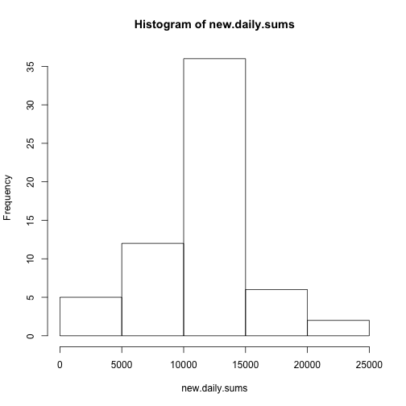
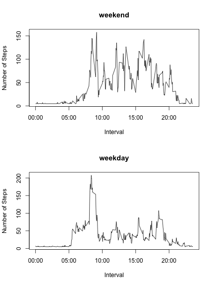

Coursera - Reproducible Research - Peer Assessment 1  
====================================================  

This is the R Markdown file for the first peer assessment assignment.  
The data file must be downloaded, unzipped, then loaded from its CSV  
format into a data frame.  

First download, unzip, and load  
-------------------------------  
We download the zipped file from the URL given in the assignment page.  
We then unzip the downloaded file into its uncompressed csv format.  
We load the data from the csv format file into our working data frame.  


```r
zip.file <- download.file("https://d396qusza40orc.cloudfront.net/repdata%2Fdata%2Factivity.zip", 
    "repdata_data_activity.zip", method = "curl")
file.conn <- unz("repdata_data_activity.zip", "activity.csv")
activ.dat <- read.csv("activity.csv", header = TRUE, sep = ",", na.strings = "NA")
```


Create directory ./figures/ in order to save plots and figures  
-------------------------------------------------------------- 

NOTE: the instructions in the assignment require a "./figures" directory.  
NOTE: the knitter directly created a a "./figure" directory (notice no "s").  
So, given the confusion on names (figure vs figures), I decided to plot twice.  
So, you will see that each plot was performed on the standard graphic device.  
This results in the plots that go under the "./figure" directory (with no s).  
You will also see that each plot was re-performed into a named png file.  
I placed this second named png file into the "./figures" directory.  

All this a little clumsy, but the instructions had that little bug in them...  


```r
if (!file.exists("./figures")) dir.create("./figures")
```


Histogram, mean and median of total steps per day  
-------------------------------------------------  
We create a subset data frame by removing the rows where the steps are NA.  
We then calculate the daily sums of steps by using the date as the factor  
along whose levels the sums are calculated, and store these in a vector.  
We then remove from this vector of sums the entires that are NA.  
These would be due to left-over dates where all initial steps were NA.  


```r
# Remove rows where there are NA values for steps in any interval

activ.dat.no.na <- activ.dat[!is.na(activ.dat$steps), ]

# Sum the steps within each level of the factor 'date', to get the daily
# sums

daily.sums <- tapply(activ.dat.no.na$steps, activ.dat.no.na$date, sum, simplify = T)

# Remove the NA values

daily.sums <- subset(daily.sums, !is.na(daily.sums))

# Plot histogram of daily steps on screen

noquote("Plotting Histogram of Daily Steps")
```

```
## [1] Plotting Histogram of Daily Steps
```

```r
hist(daily.sums)
```

 

```r

# Plot histoggram of daily steps in a png file

png(file = "./figures/first-question-daily-steps-histogram.png")
hist(daily.sums)
dev.off()
```

```
## pdf 
##   2
```

```r

# Calculate mean and print it

daily.mean <- mean(daily.sums)
noquote("Daily Step Mean is: ")
```

```
## [1] Daily Step Mean is:
```

```r
daily.mean
```

```
## [1] 10766
```

```r

# Calculate median and print it

daily.median <- median(daily.sums)
noquote("Daily Step Median is: ")
```

```
## [1] Daily Step Median is:
```

```r
daily.median
```

```
## [1] 10765
```


Plot, mean and median of steps per 5-minute interval, averaged over all days  
----------------------------------------------------------------------------  

Rather than looking at the data by the day factor, we now analyse it by interval.  
So we average over all days, the steps that were taken in each of the 5-min intervals.  


```r

# Use tapply to apply the mean along the levels of the interval viewed as a
# factor

interval.means <- tapply(activ.dat.no.na$steps, activ.dat.no.na$interval, mean, 
    simplify = T)

# Now plot the values as requested in the assignment: First plot without the
# x-axis, in order to add better formatted times Then add the x-axis using
# the axis() command

plot(levels(as.factor(activ.dat.no.na$interval)), interval.means, xaxt = "n", 
    xlab = "5-Min Intervals", ylab = "Average Steps", main = "Line Plot of Average Steps Versus 5-Min Intervals", 
    type = "l")

# Create a vector of labels to mark the ticks on the x-axis Put these labels
# at the computed locations for tick marks Parameter 1 is what describes the
# x-axis in axis-related functions Also, draw a vertical blue line to mark
# the interval with max steps

x.labels <- c("00:00", "05:00", "10:00", "15:00", "20:00")
axis(1, at = axTicks(1), labels = x.labels)
abline(v = activ.dat.no.na$interval[which.max(interval.means)], col = "blue")
```

 

```r

# Now redo the same plotting into a png file

png(file = "./figures/average-steps-per-5min-intervals-line-plot.png")
plot(levels(as.factor(activ.dat.no.na$interval)), interval.means, xaxt = "n", 
    xlab = "5-Min Intervals", ylab = "Average Steps", main = "Line Plot of Average Steps Versus 5-Min Intervals", 
    type = "l")
axis(1, at = axTicks(1), labels = x.labels)
abline(v = activ.dat.no.na$interval[which.max(interval.means)], col = "blue")
dev.off()
```

```
## pdf 
##   2
```

```r

# Now print the value of the interval with the largest average steps Mark
# the starting and ending times of that interval, to show both

int.start <- as.integer(activ.dat.no.na$interval[which.max(interval.means)])

# Calculate end of the interval Most of the time, this is 5 plus the start
# of the interval Except when the start is some hour plus 55 minutes...  ...
# in which case the end interval is the next hour...  ... which gets written
# as the interval start plus 45.  Example: 155 refers to 01:55, and the next
# 5-min boundary is 200 for 02:00

if (int.start%%100 == 55) {
    int.end <- int.start + 45
} else {
    int.end <- int.start + 5
}
int.start <- as.character(int.start)
int.end <- as.character(int.end)

# Stuff with leading zeros and insert ':' to pretty things up

pretty <- function(string) {
    switch(nchar(string), paste("000", string, sep = ""), paste("00", string, 
        sep = ""), paste("0", string, sep = ""), string)
}
int.start <- pretty(int.start)
int.end <- pretty(int.end)

# Insert ':' separator between hours and minutes

int.start <- paste(substr(int.start, 1, 2), ":", substr(int.start, 3, 4), sep = "")
int.end <- paste(substr(int.end, 1, 2), ":", substr(int.end, 3, 4), sep = "")

# Prepare interval string for printing, with square brackets and dash sign

int.string <- paste("[", int.start, "-", int.end, "]", sep = "")
noquote("Interval with highest average step count:")
```

```
## [1] Interval with highest average step count:
```

```r
int.string
```

```
## [1] "[08:35-08:40]"
```


Imputing Missing Values  
-----------------------  

In this section, we will perform the following:  

- Calculate how many rows have NA in the $steps column
- Devise a strategy for filling the NA values
- Build a new data frame with all the missing values filled in
- Plot histogram and calculate mean and median for total daily steps in new dataset
- Compare these mean and median values to those without the imputed values


```r

# Number of rows with missing values for steps

nrow.miss <- nrow(activ.dat) - nrow(activ.dat.no.na)
noquote("The number of rows with missing values for steps is: ")
```

```
## [1] The number of rows with missing values for steps is:
```

```r
nrow.miss
```

```
## [1] 2304
```


Strategies for imputing the missing values:  

NOTE: The analysis that evaluates different strategies below can be skipped.  
NOTE: I played around a little to assess the per-day-mean approach to replace NAs,   
vs the per-interval-mean approach to replace NAs with means from same intervals. 
  
That part wasn't required to be laid out explicitly.  
If you want to skip to the punch line, I ended up replacing the NA values  
with daily averages from the same day where the NA values fell.  
  
My comments below say as much, but after some elements of the analysis...  
  
[Analysis Part (can be skipped if bored)]
-----------------------------------------  
  
We check the standard deviations of two sets of distributions.  
The first is the distribution of total daily steps over the days of the study.  
The second is the set of individual distributions of intra-interval steps,  
for each interval, and averaged all of the days of the study.  
  
Standard deviation of per-interval values calculated from daily sums:  
  

```r
daily.steps.per.interv <- daily.sums/nlevels(as.factor(activ.dat$interval))
sd.from.daily.sums <- sd(daily.steps.per.interv)
sd.from.daily.sums
```

```
## [1] 14.82
```

  
With a standard deviation of 14.8, and with a mean and median for daily steps  
being very close to one another at 10766 for total daily steps, and therefore  
at 10766/288 = 37.38 for values we'd plug into the missing slots, we would be  
using mean/median from a fairly symmetric distribution and with a coefficient  
of variation (standard deviation divided by mean) of about 0.4.  
  
So the approach above would be a pretty robust approach of imputing values.  
  
If, as an alternative, we used the data from the individual 5-minute intervals,  
and filled a missing value in one such interval with the median or the mean of  
that particular interval where the missing value lies, we would want to check  
how that might perform.  
  
Let's calculate the medians of the per-interval distributions, compare these  
to the means of the per-interval distributions, and also calculate each of  
the per-interval standard deviations, to have some sense for the robustness  
of this second approach.  
  

```r

# Medians within Intervals

interval.meds <- tapply(activ.dat.no.na$steps, activ.dat.no.na$interval, median, 
    simplify = T)
interval.meds
```

```
##    0    5   10   15   20   25   30   35   40   45   50   55  100  105  110 
##    0    0    0    0    0    0    0    0    0    0    0    0    0    0    0 
##  115  120  125  130  135  140  145  150  155  200  205  210  215  220  225 
##    0    0    0    0    0    0    0    0    0    0    0    0    0    0    0 
##  230  235  240  245  250  255  300  305  310  315  320  325  330  335  340 
##    0    0    0    0    0    0    0    0    0    0    0    0    0    0    0 
##  345  350  355  400  405  410  415  420  425  430  435  440  445  450  455 
##    0    0    0    0    0    0    0    0    0    0    0    0    0    0    0 
##  500  505  510  515  520  525  530  535  540  545  550  555  600  605  610 
##    0    0    0    0    0    0    0    0    0    0    0    0    0    0    0 
##  615  620  625  630  635  640  645  650  655  700  705  710  715  720  725 
##    0    0    0    0    0    0    0    8   13    7   13   14    0    0   12 
##  730  735  740  745  750  755  800  805  810  815  820  825  830  835  840 
##    0    0   15   19   19   28   41   25   32   13   45   33   37   19   51 
##  845  850  855  900  905  910  915  920  925  930  935  940  945  950  955 
##   60   16   43   20    8   31   15   16    0    0    0    0    0    0    0 
## 1000 1005 1010 1015 1020 1025 1030 1035 1040 1045 1050 1055 1100 1105 1110 
##    0    0    0    0    0    0    0    0    0    0    0    0    0    0    0 
## 1115 1120 1125 1130 1135 1140 1145 1150 1155 1200 1205 1210 1215 1220 1225 
##    0    0    0    0    0    0    0    0    0    0    0    6   10    0    0 
## 1230 1235 1240 1245 1250 1255 1300 1305 1310 1315 1320 1325 1330 1335 1340 
##    0    0    0    0    0    0    0    0    0    0    0    0    0    0    0 
## 1345 1350 1355 1400 1405 1410 1415 1420 1425 1430 1435 1440 1445 1450 1455 
##    0    0    0    0    0    0    0    0    0    0    0    0    0    0    0 
## 1500 1505 1510 1515 1520 1525 1530 1535 1540 1545 1550 1555 1600 1605 1610 
##    0    0    0    0    0    0    0    0    0    0    0    0    0    0    0 
## 1615 1620 1625 1630 1635 1640 1645 1650 1655 1700 1705 1710 1715 1720 1725 
##    0    0    0    0    0    0    0    0    0    0    0    0    7    7    0 
## 1730 1735 1740 1745 1750 1755 1800 1805 1810 1815 1820 1825 1830 1835 1840 
##    7    7   26    7    0   10   15   18   26   25   24    9   33   26   34 
## 1845 1850 1855 1900 1905 1910 1915 1920 1925 1930 1935 1940 1945 1950 1955 
##   42   33   30   33   30    8    8    7    0    0    0    0    0    0    0 
## 2000 2005 2010 2015 2020 2025 2030 2035 2040 2045 2050 2055 2100 2105 2110 
##    0    0    0    0    0    0    0    0    0    0    0    0    0    0    0 
## 2115 2120 2125 2130 2135 2140 2145 2150 2155 2200 2205 2210 2215 2220 2225 
##    0    0    0    0    0    0    0    0    0    0    0    0    0    0    0 
## 2230 2235 2240 2245 2250 2255 2300 2305 2310 2315 2320 2325 2330 2335 2340 
##    0    0    0    0    0    0    0    0    0    0    0    0    0    0    0 
## 2345 2350 2355 
##    0    0    0
```

```r

# Standard Deviations within Intervals

interval.sds <- tapply(activ.dat.no.na$steps, activ.dat.no.na$interval, sd, 
    simplify = T)
interval.sds
```

```
##        0        5       10       15       20       25       30       35 
##   7.9768   2.4725   0.9615   1.0989   0.5494   8.7558   3.8461   6.3186 
##       40       45       50       55      100      105      110      115 
##   0.0000   9.9084   1.5390   0.9615   2.3351   4.9450   1.0989   2.4725 
##      120      125      130      135      140      145      150      155 
##   0.0000   8.1043   7.8145   1.2362   0.8712   1.9338   1.9230   0.0000 
##      200      205      210      215      220      225      230      235 
##   0.0000   0.0000   7.7012   0.0000   0.0000   0.9615   0.0000   1.6483 
##      240      245      250      255      300      305      310      315 
##   0.0000   0.0000   6.4972   6.8680   0.0000   0.0000   0.0000   0.0000 
##      320      325      330      335      340      345      350      355 
##   1.5110   4.5329   7.5555   2.4450   2.5692   0.5494   0.0000   0.0000 
##      400      405      410      415      420      425      430      435 
##   7.9833   5.5380  10.8247   0.0000   1.7314   2.6099  13.5996   4.0523 
##      440      445      450      455      500      505      510      515 
##  19.6465   3.5881  11.9658   3.7859   0.0000   6.2095  14.8311  10.4714 
##      520      525      530      535      540      545      550      555 
##  13.7600  11.7211   9.9330  28.3592 101.8909 104.4741 153.6633 149.3080 
##      600      605      610      615      620      625      630      635 
## 122.7950 172.2814 176.9312 179.7459 155.6095 151.7679 157.5272 104.6691 
##      640      645      650      655      700      705      710      715 
## 109.4392 124.9483  88.4184 111.2599 111.8442 114.8463 141.6881 144.4095 
##      720      725      730      735      740      745      750      755 
## 148.7066 143.5632 130.7322 107.2493 102.3676 128.3401 107.2921  91.7550 
##      800      805      810      815      820      825      830      835 
## 122.6648 101.2045 199.1250 267.5455 255.4200 242.9440 249.4834 292.9958 
##      840      845      850      855      900      905      910      915 
## 263.3781 238.7957 266.2231 239.7162 225.2730 200.8349 181.8179 183.0442 
##      920      925      930      935      940      945      950      955 
## 174.7524 190.7147 157.6612 119.7243  70.3468  97.3032  82.2371  57.5077 
##     1000     1005     1010     1015     1020     1025     1030     1035 
## 109.2600  88.9742 109.4179 130.9799  97.4746 131.2173 105.7852 114.9688 
##     1040     1045     1050     1055     1100     1105     1110     1115 
##  96.3937  85.6248  65.8741  69.2155  71.6737  77.8074  55.3860  59.8375 
##     1120     1125     1130     1135     1140     1145     1150     1155 
##  78.9718  64.2081  83.0441 118.6421 124.6136 126.2731 122.0610 126.5940 
##     1200     1205     1210     1215     1220     1225     1230     1235 
## 111.7051 152.4585 161.0405 151.7534 118.8511  99.5447 120.6813  89.7737 
##     1240     1245     1250     1255     1300     1305     1310     1315 
##  82.2259 100.9191 109.5511 134.1651 115.1743 109.6825 121.5617 118.6336 
##     1320     1325     1330     1335     1340     1345     1350     1355 
## 110.4801 115.8981  88.1517  63.1205 101.2423 116.9970 118.3854 125.4618 
##     1400     1405     1410     1415     1420     1425     1430     1435 
## 131.8372 114.2640 107.4121 118.2131  81.3838  88.1905 100.2711  62.4021 
##     1440     1445     1450     1455     1500     1505     1510     1515 
##  36.2219  74.0015 111.6592 119.5985  96.7277  95.4844 116.3724 119.4206 
##     1520     1525     1530     1535     1540     1545     1550     1555 
## 136.5489 135.4932 133.1565 155.9936 172.0257 162.2190 195.2352 177.7229 
##     1600     1605     1610     1615     1620     1625     1630     1635 
## 146.3754 166.8421 186.0997 172.5057 170.9102 173.7411 142.0584 128.6681 
##     1640     1645     1650     1655     1700     1705     1710     1715 
## 115.4754 127.5734 114.7744 104.9289 124.1335 146.8503 128.8607 128.4901 
##     1720     1725     1730     1735     1740     1745     1750     1755 
## 134.8682 152.5658 144.4477 103.5476 113.5741 113.6489  75.2781  74.9537 
##     1800     1805     1810     1815     1820     1825     1830     1835 
##  69.0738 105.8756 123.8090 140.7426  99.5830 129.0143 137.7921 136.8411 
##     1840     1845     1850     1855     1900     1905     1910     1915 
## 142.1715 152.1909 140.9744 147.5027 141.8238 127.6036 121.2420 116.4529 
##     1920     1925     1930     1935     1940     1945     1950     1955 
##  66.7287  34.4475  45.2299 101.9192  69.1276  75.9774 111.6629  94.4330 
##     2000     2005     2010     2015     2020     2025     2030     2035 
##  68.8868  78.3509  67.6345  96.5989  96.8591  94.9854  85.9545  81.1667 
##     2040     2045     2050     2055     2100     2105     2110     2115 
##  73.7482  73.7957 101.7861  54.5705  36.0205  53.5029  49.4806  39.7719 
##     2120     2125     2130     2135     2140     2145     2150     2155 
##  29.2703  18.5685  34.1878  61.2754  23.4527  39.6428  30.1005  10.0369 
##     2200     2205     2210     2215     2220     2225     2230     2235 
##   7.3080  16.3092  20.9101  25.6962  27.7696  53.4785  54.7585  11.2752 
##     2240     2245     2250     2255     2300     2305     2310     2315 
##   2.3351   0.8242   8.3582  26.1676  14.6045  14.6647   0.0000   4.2505 
##     2320     2325     2330     2335     2340     2345     2350     2355 
##   7.0054   6.5234  10.0371  25.0581  15.5929   3.7164   1.2191   4.8905
```


We see that many of the medians are zero-valued where the means are not.  
We also see that the standard deviations are very small for some intervals  
(which would have been good if we imputed from means) but much larger for  
some other intervals, particularly those where the modes of the steps are.  
  
So, all in all, it might be more robust and and slightly simpler to stick  
with an imputation method that fills the missing values with the values  
from the daily sums, divided by the number of daily intervals, i.e., 288.  
  
[Resume here if skipped the optional analysis above]
----------------------------------------------------
  
We now create the new data set with missing values imputed using the mean  
from the daily sums, divided by the number of daily intervals (288).  
  

```r
activ.newdat <- activ.dat
activ.newdat[is.na(activ.dat$steps), 1] <- daily.mean/nlevels(as.factor(activ.newdat$interval))
```

  
We now plot the histogram on this new dataset with imputed values for steps:  
  

```r
new.daily.sums <- tapply(activ.newdat$steps, activ.newdat$date, sum, simplify = T)

# Remove the NA values

new.daily.sums <- subset(new.daily.sums, !is.na(new.daily.sums))

# Plot histogram of daily steps

noquote("Plotting Histogram of Daily Steps With Imputed Data:")
```

```
## [1] Plotting Histogram of Daily Steps With Imputed Data:
```

```r
hist(new.daily.sums)
```

 

```r

# Plot histogram again into a png file

png("./figures/daily-steps-histogram-with-imputed-data.png")
hist(new.daily.sums)
dev.off()
```

```
## pdf 
##   2
```

  
Calculate the new values for mean and median of daily sums of steps.  
These are computed on the new dataset with the imputed values where  
there was missing data in the original dataset.  
  

```r
# Calculate new mean and print it

new.daily.mean <- mean(new.daily.sums)
noquote("New Daily Step Mean: ")
```

```
## [1] New Daily Step Mean:
```

```r
new.daily.mean
```

```
## [1] 10766
```

```r

# Calculate new median and print it

new.daily.median <- median(new.daily.sums)
noquote("New Daily Step Median: ")
```

```
## [1] New Daily Step Median:
```

```r
new.daily.median
```

```
## [1] 10766
```

  
We make the following observations on the new dataset:  
  
While the initial values for mean and median of total daily steps were already  
very close at 10,766.19 and 10,765, respectively, the new values for mean and  
median are now both 10,766.19. So, by imputing a common value on a fairly large  
number of missing NA entries, we have made the distribution even more centered  
around a common mean, median, mode.  
  
In terms of summary statistics, however, the imputation has barely had any impact  
on the estimates for total daily steps, when using mean or median for estimating.  
  
Activity Patterns Between Week Days and Week Ends
-------------------------------------------------
  
We create a new factor variable in the data frame, called daytype.  
The factor has two values: "weekday" and "weekend".  
  

```r

# First turn the date variable into a Date type

activ.newdat$date <- as.Date(activ.newdat$date)

# Now create new factor with type of day in the week, called daytype It will
# take one of two values (levels): 'weekday' or 'weekend'

activ.newdat$daytype <- "weekday"
activ.newdat$daytype[weekdays(activ.newdat$date) %in% c("Saturday", "Sunday")] <- "weekend"

# Make it a factor

activ.newdat$daytype <- as.factor(activ.newdat$daytype)
```

  
Now plot the steps time series over the 5-min intervals, factored by daytype:  
  

```r

# Calculate vector of means within each interval, averaged over weekdays in
# the dataset

activ.newdat$interval <- as.factor(activ.newdat$interval)

# Split data frame into 2, one for weekdays and one for weekends

weekday.dat <- activ.newdat[activ.newdat$daytype == "weekday", ]
weekend.dat <- activ.newdat[activ.newdat$daytype == "weekend", ]

# Generate the 2 vectors tha will be on the y-axis in the 2 plots

weekday.interval.means <- tapply(weekday.dat$steps, weekday.dat$interval, mean, 
    simplify = T)
weekend.interval.means <- tapply(weekend.dat$steps, weekend.dat$interval, mean, 
    simplify = T)

# Split the screen vertically

par(mfrow = c(2, 1))

plot(levels(weekend.dat$interval), weekend.interval.means, xaxt = "n", xlab = "Interval", 
    ylab = "Number of Steps", main = "weekend", type = "l")

# Create a vector of labels to mark the ticks on the x-axis Put these labels
# at the computed locations for tick marks Parameter 1 describes the x-axis
# in axis-related functions

x.labels <- c("00:00", "05:00", "10:00", "15:00", "20:00")
axis(1, at = axTicks(1), labels = x.labels)

plot(levels(weekday.dat$interval), weekday.interval.means, xaxt = "n", xlab = "Interval", 
    ylab = "Number of Steps", main = "weekday", type = "l")

axis(1, at = axTicks(1), labels = x.labels)
```

 

```r

# Now plot again into a png file within the ./figures directory

png("./figures/stacked-line-plots-per-5min-interval-weekday-weekend.png")

par(mfrow = c(2, 1))

plot(levels(weekend.dat$interval), weekend.interval.means, xaxt = "n", xlab = "Interval", 
    ylab = "Number of Steps", main = "weekend", type = "l")
axis(1, at = axTicks(1), labels = x.labels)

plot(levels(weekday.dat$interval), weekday.interval.means, xaxt = "n", xlab = "Interval", 
    ylab = "Number of Steps", main = "weekday", type = "l")
axis(1, at = axTicks(1), labels = x.labels)

dev.off()
```

```
## pdf 
##   2
```


